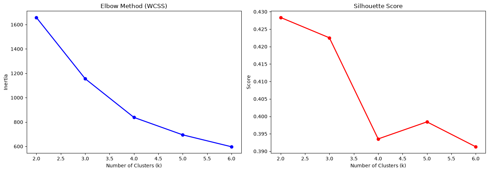
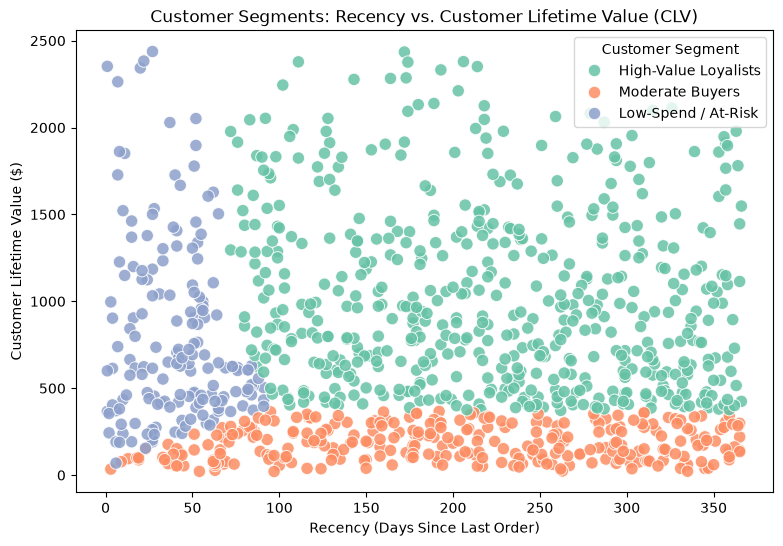
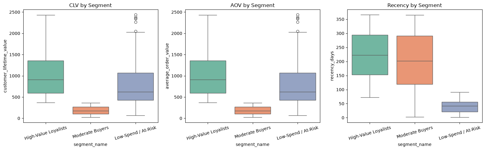

# 🛒 Customer Segmentation and Prediction using KMeans Clustering


An end-to-end **unsupervised machine learning** project that segments online retail customers into actionable groups using **KMeans Clustering**, enabling targeted marketing and customer retention strategies.

---

## 📖 Table of Contents

- [Overview](#overview)
- [Dataset](#dataset)
- [Methodology](#methodology)
- [Visualizations](#visualizations)
- [Results & Insights](#results--insights)
- [Tech Stack](#tech-stack)
- [Getting Started](#getting-started)
- [Project Structure](#project-structure)
- [License](#license)

---

## Overview

Customer segmentation is a critical strategy in retail analytics. This project applies **KMeans Clustering** to a synthetic online retail dataset with 1,000 customer records and 18 features to identify distinct customer groups based on purchasing behavior.

### Key Objectives
- **Segment** customers into meaningful groups using unsupervised learning
- **Analyze** purchasing patterns across recency, frequency, and monetary (RFM) dimensions
- **Visualize** cluster characteristics with publication-quality plots
- **Predict** customer segment membership for new data points

---

## Dataset

The dataset (`synthetic_online_retail_engineered.csv`) contains **1,000 records** with **18 features**:

| Feature | Description |
|---------|-------------|
| `customer_id` | Unique customer identifier |
| `order_date` | Date of purchase |
| `product_id` / `category_id` | Product and category identifiers |
| `category_name` / `product_name` | Human-readable product info |
| `quantity` | Number of items purchased |
| `price` | Unit price of the product |
| `payment_method` | Payment type used |
| `city` | Customer's city |
| `review_score` | Product review rating (799 non-null) |
| `gender` | Customer gender (897 non-null) |
| `age` | Customer age |
| `total_spend` | Total amount spent |
| `recency_days` | Days since last purchase |
| `purchase_frequency` | Number of purchases made |
| `customer_lifetime_value` | Estimated CLV |
| `average_order_value` | Mean order value |

---

## Methodology

### 1. Data Preprocessing
- Aggregated data at the customer level using `groupby`
- Selected key features: `recency_days`, `purchase_frequency`, `average_order_value`, `customer_lifetime_value`
- Applied **log transformation** (`np.log1p`) to handle skewness
- Standardized features using **StandardScaler** for unit variance

### 2. Optimal Cluster Selection
Evaluated clusters (k=2 to k=6) using two methods:
- **Elbow Method (WCSS)** — identifies the "elbow" point where adding clusters yields diminishing returns
- **Silhouette Score** — measures intra-cluster cohesion vs. inter-cluster separation

**Optimal k = 3** was selected based on both metrics.

### 3. KMeans Clustering
Applied KMeans with `k=3` clusters, resulting in three distinct customer segments:

| Cluster | Segment Name | Description |
|---------|-------------|-------------|
| 0 | **Moderate Buyers** | Mid-range spenders with average recency |
| 1 | **High-Value Loyalists** | High CLV, higher order values |
| 2 | **Low-Spend / At-Risk** | Low spending, potentially churning customers |

---

## Visualizations

### 📊 Elbow Method & Silhouette Score
The dual plot below shows the optimal number of clusters. The elbow in the WCSS plot aligns with the peak in silhouette score at **k=3**.



---

### 🔵 Customer Segments: Recency vs. CLV
This scatter plot maps each customer by their recency (days since last order) and lifetime value, colored by their assigned segment. Clear separation between High-Value Loyalists and Low-Spend customers is visible.



---

### 📦 Segment Comparison Box Plots
Side-by-side box plots comparing CLV, Average Order Value, and Recency across segments, revealing the distinct behavioral profiles of each group.



---

## Results & Insights

| Metric | Moderate Buyers | High-Value Loyalists | Low-Spend / At-Risk |
|--------|:---:|:---:|:---:|
| **CLV Range** | Mid ($200–$600) | High ($600–$2,400+) | Low ($20–$200) |
| **Recency** | Varied | Varied | Varied |
| **AOV** | Mid-range | High | Low |

### 💡 Business Recommendations

- **High-Value Loyalists** → Reward programs, exclusive offers, VIP treatment
- **Moderate Buyers** → Upselling campaigns, personalized recommendations to increase AOV
- **Low-Spend / At-Risk** → Re-engagement campaigns, discounts, win-back emails

---

## Tech Stack

| Tool | Purpose |
|------|---------|
| **Python 3.10+** | Core programming language |
| **Pandas** | Data manipulation and aggregation |
| **NumPy** | Numerical transformations (log1p) |
| **scikit-learn** | KMeans, StandardScaler, Silhouette Score |
| **Matplotlib** | Static plotting (Elbow, Silhouette) |
| **Seaborn** | Statistical visualizations (scatter, box plots) |
| **Jupyter Notebook** | Interactive development environment |

---

## Getting Started

### Prerequisites
```bash
pip install pandas numpy scikit-learn matplotlib seaborn jupyter
```

### Run the Notebook
```bash
git clone https://github.com/<your-username>/customer-segmentation-kmeans.git
cd customer-segmentation-kmeans
jupyter notebook Customer_Segmentation_KMeans.ipynb
```

> **Note:** Update the file path in Cell 3 to point to your local copy of the dataset, or use the one provided in the `data/` folder.

---

## Project Structure

```
customer-segmentation-kmeans/
│
├── Customer_Segmentation_KMeans.ipynb   # Main Jupyter Notebook
├── README.md                            # Project documentation
├── requirements.txt                     # Python dependencies
├── .gitignore                           # Git ignore rules
│
├── data/
│   └── synthetic_online_retail_engineered.csv  # Dataset
│
└── images/
    ├── output_cell_9.png                # Elbow + Silhouette plot
    ├── output_cell_11.png               # Scatter plot (Recency vs CLV)
    └── output_cell_13.png               # Box plot comparison
```

---

## License

This project is licensed under the MIT License. See [LICENSE](LICENSE) for details.

---

<p align="center">
  <i>Built with ❤️ for Data Science & Machine Learning</i>
</p>
